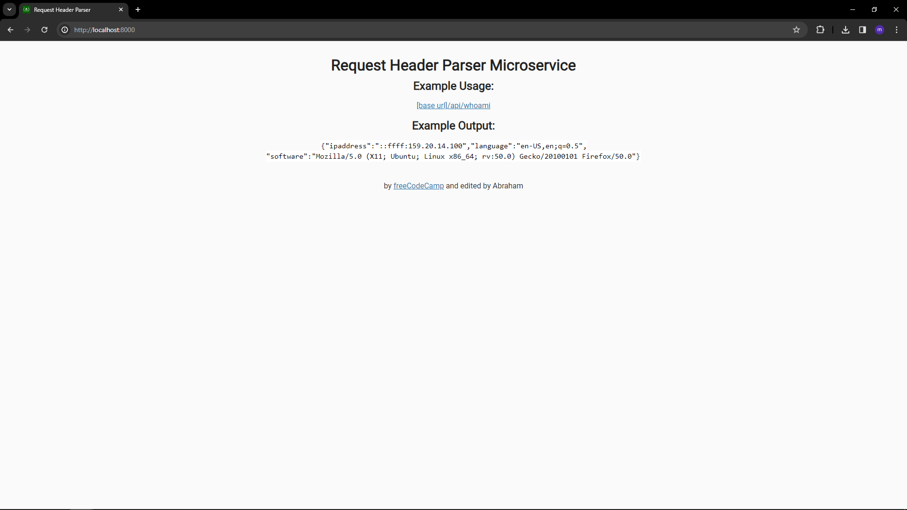

<h1>HEADER API </h1>

This is a simple project from <a href="www.freecodecamp.com">freecodecamp</a> for the backend certification. but I change the folder structure (MVC without model). I also added some test to it.

<h2>Follow these steps to run this project</h2>
<ol><ul>Git Clone the project</ul><ul>run: npm install</ul><ul>run: npm run watch</ul> </ol>

<h2>TO USE</h2>
<ol>
<ul>Run the project</ul>
<ul>Click the link</ul>
<ul>Enjoy (if you want to)</ul>
</ol>

<h2>NOTES</h2>
<ol>
<ul>Make sure you have node installed</ul>
<ul>to run test, type: npm run test</ul>

</ol>
